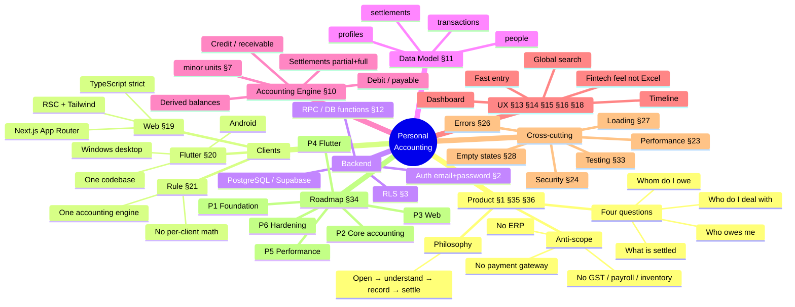
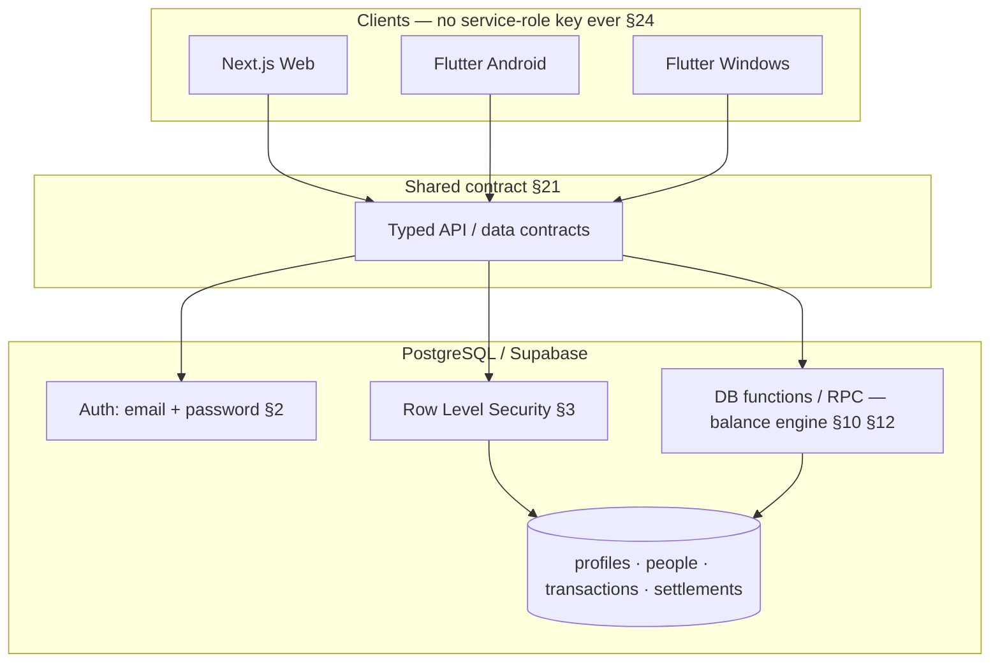
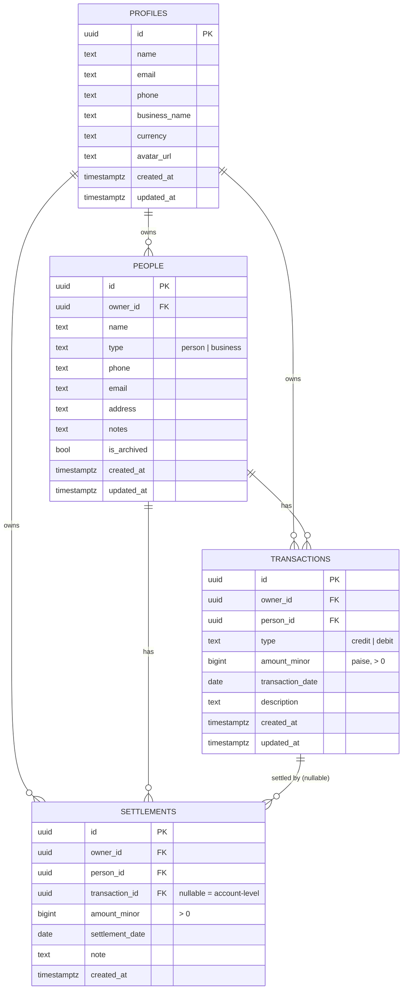
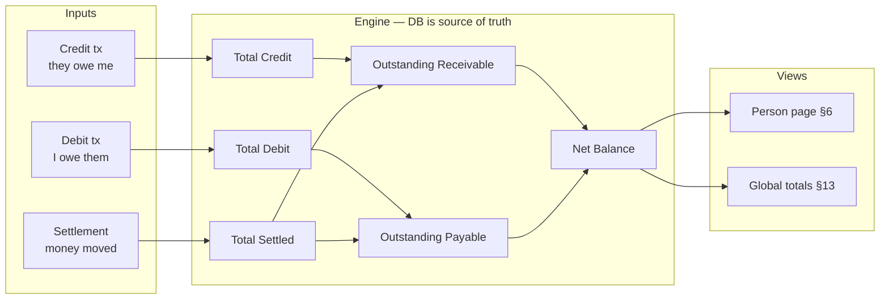
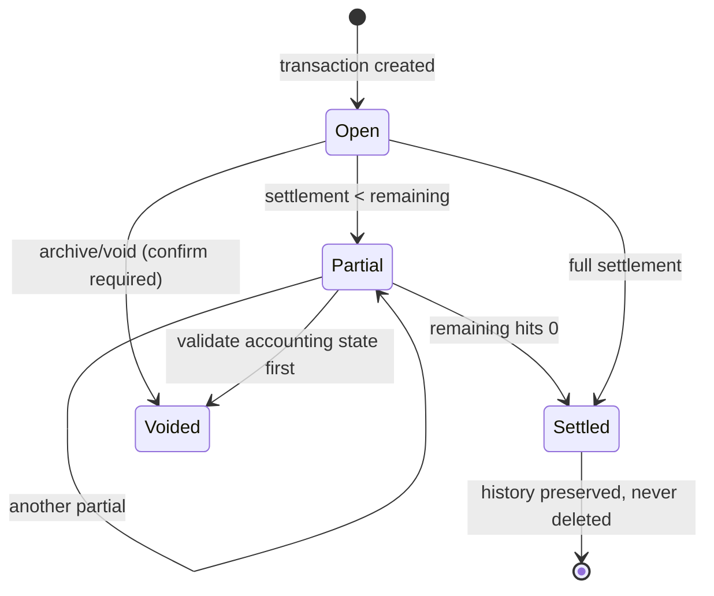
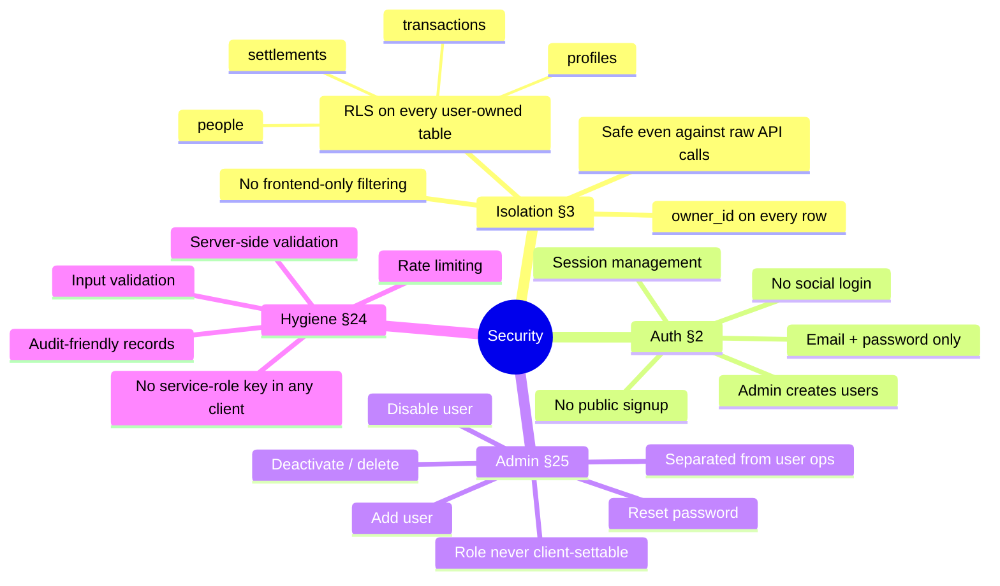
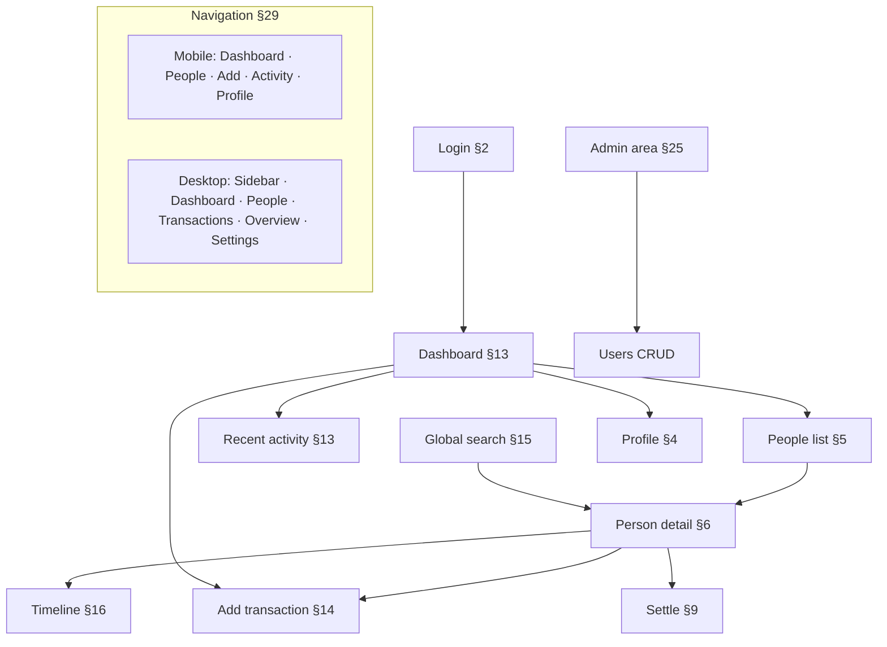
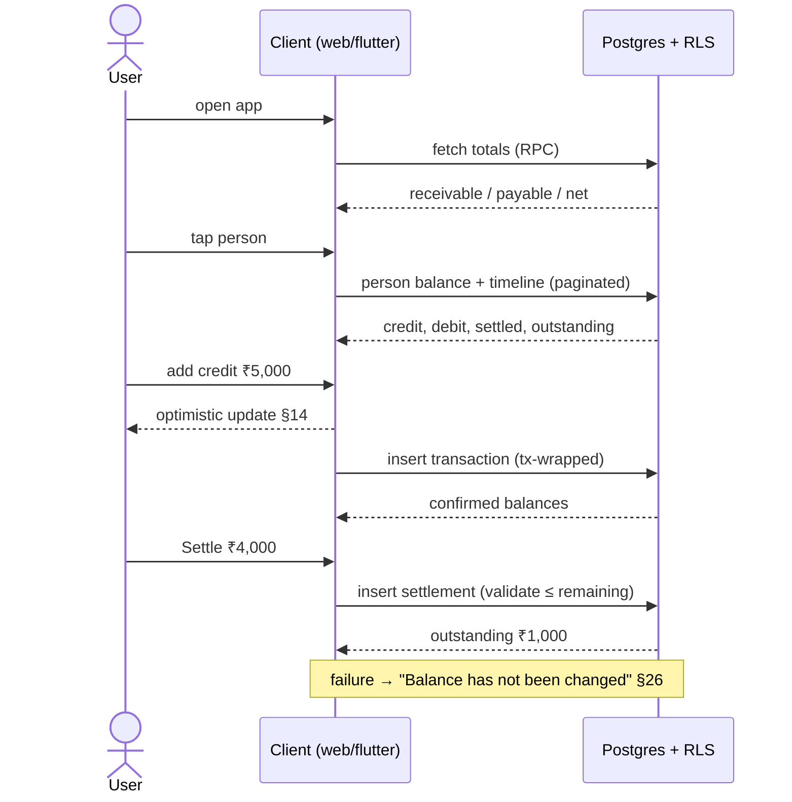
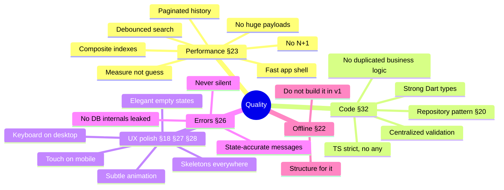
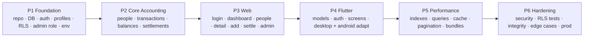

# Accounting System — Mindmap

Companion to [`context.md`](./context.md). Same scope, visual form.
Every node traces back to a `context.md` section (§n).

---

## 1. Master Mindmap



---

## 2. System Architecture (§21)



**Invariant:** balances are computed in one place (DB/RPC). Clients render, never re-derive. §10 §21

---

## 3. Data Model (§11)



### Constraints & indexes

| Kind | Rule | §ref |
|---|---|---|
| Check | `amount_minor > 0` | §12 |
| Check | `type in ('credit','debit')` | §11 |
| FK guard | person.owner_id = transaction.owner_id | §12 |
| FK guard | settlement.owner_id = transaction.owner_id | §12 |
| Business | settlement ≤ remaining (unless overpay allowed) | §12 |
| Preserve | never hard-delete settled history → archive/void | §17 |
| Index | `owner_id` | §23 |
| Index | `(owner_id, person_id)` | §23 |
| Index | `(owner_id, transaction_date desc)` | §23 |
| Index | `created_at` | §23 |

---

## 4. Accounting Model (§7 §8 §9 §10)



**Money rule §7:** integer minor units only. `₹100.50 → 10050`. No float in TS or Dart as source of truth.

### Settlement lifecycle (§9 §17)



---

## 5. Security & Isolation (§3 §24 §25)



**Threat cases to test §33:** cross-user person IDs, cross-user transaction IDs, unauthorized read, privilege escalation to admin.

---

## 6. Screen Map (§6 §13 §14 §15 §16 §29)



### Person detail = the key screen (§6)

```text
Rahul Traders
You will receive  ₹18,500
You will pay      ₹6,000
Net balance       ₹12,500 receivable
────────────────────────────
timeline: credit / debit / settlement, newest first
```

Credit and debit live on **one** page. Never split into separate modules.

---

## 7. Core Flow (§36)



---

## 8. Quality Bars



### Test matrix (§33)

| Case | Input | Expected |
|---|---|---|
| Credit | +10,000 | outstanding 10,000 |
| Debit | +5,000 | outstanding 5,000 |
| Partial settle | 10,000 − 4,000 | 6,000 |
| Full settle | 10,000 − 10,000 | 0, history kept |
| Multiple | 10,000 + 5,000 − 3,000 | 12,000 |
| Mixed | credit 10,000 / debit 4,000 | net 6,000 receivable |
| RLS | user A reads B's row | denied |
| Escalation | user self-sets admin | denied |

---

## 9. Roadmap (§34)



### Deliverables checklist (§Deliverables)

- [ ] Architecture doc
- [ ] Schema + SQL migrations
- [ ] RLS policies
- [ ] Auth implementation
- [ ] Admin implementation
- [ ] Balance engine + settlement logic
- [ ] Next.js web app
- [ ] Flutter Android app
- [ ] Flutter Windows app
- [ ] Shared API/data contracts
- [ ] Tests (accounting + RLS)
- [ ] Seed/demo data
- [ ] `.env.example`
- [ ] Deployment instructions
- [ ] Performance notes
- [ ] Security notes

---

## 10. Out of Scope (§25 §30 §31 §35)

```text
✗ CRM          ✗ Payroll        ✗ Inventory
✗ HR           ✗ Tax / GST      ✗ Invoicing
✗ Expenses     ✗ Banking        ✗ Payment gateways
✗ Social auth  ✗ Public signup  ✗ Push/email infra
✗ Heavy reporting engine        ✗ Full offline sync in v1
```

If a feature does not answer one of the four questions in §35 — leave it out.
